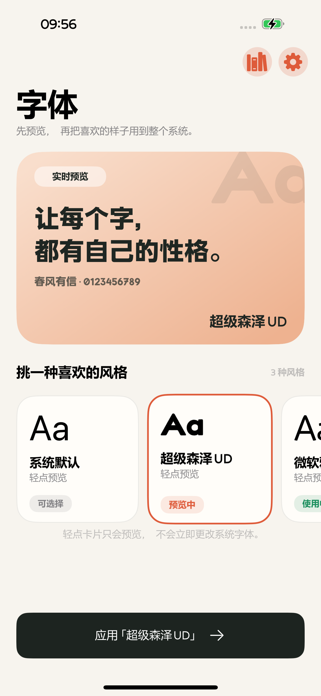
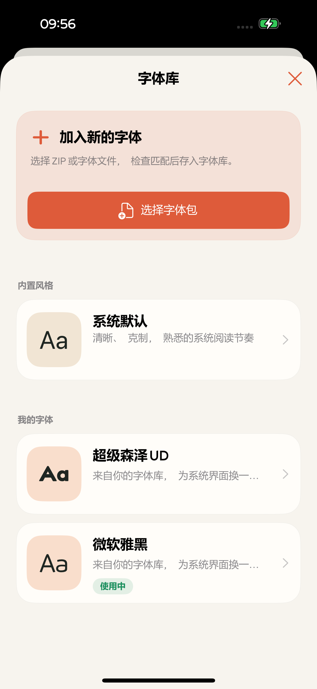

# MarkFont

MarkFont 是一款面向 RootHide 环境的 iOS 全局字体管理器，可在 App 内导入字体、管理字体方案并切换系统字体。

## Screenshots

<p align="center">
  
  
</p>

## Features

- 支持 ZIP、TTF、TTC 和 OTF 字体导入
- 支持多字体方案管理与快速切换
- 支持恢复系统默认字体
- 使用只读 bindfs mapping，避免直接修改 iOS 系统字体文件
- 支持重新越狱后自动恢复字体 mapping
- 支持安全接管旧版 bindfs 字体目录

## Compatibility

- iOS 17.0+
- Relaxin / RootHide
- `arm64` and `arm64e`
- `com.nan.bindfs >= 0.6.0`

当前版本已在 iPhone 15 Pro、iOS 17.3.1（21D61）和 Relaxin 0.4.2 上验证。其他环境尚未测试。

## Build

需要安装 [RootHide Theos](https://github.com/roothide/theos) 及兼容的 iOS SDK。

```bash
export THEOS=/path/to/roothide-theos
make clean package THEOS_PACKAGE_SCHEME=roothide
```

生成的 RootHide `.deb` 位于 `packages/`。

## Warning

字体文件不完整或与系统不兼容可能导致文字空白或界面不可用。安装前请确保你能够进入
RootHide safe mode 并移除软件包。请勿强制删除 MarkFont 的恢复数据或手动修改系统字体目录。

## Acknowledgements

- [RootHide](https://github.com/roothide/Developer)：提供 RootHide 架构与兼容基础
- [Theos](https://theos.dev/)：提供 iOS 越狱开发与打包工具链
- [mount_bindfs](https://invalidunit.github.io/repo/)：赵楠提供的字体目录映射依赖
- [Relaxin](https://relaxin.owngoal.dev/)：提供本项目当前适配与测试的越狱环境

## Disclaimer

MarkFont 仅提供字体管理功能，不提供、销售、授权或分发任何第三方字体文件。字体文件、
字形设计、字体名称及相关内容可能受到版权、商标、字体许可或其他权利保护。用户在导入、
安装、使用、复制或分发任何字体前，应自行确认已取得必要授权，并遵守字体许可与适用法律。

用户导入的字体由用户自行选择和获取，项目维护者与贡献者不审核其来源或授权状态。在适用
法律允许的最大范围内，项目维护者与贡献者不对用户未经授权或违法使用字体所引起的侵权主张、
损失或其他责任负责，也不对字体兼容性或不当操作造成的设备异常、数据丢失或系统不稳定负责。

MarkFont 的 `GPL-3.0-only` 许可仅适用于本项目软件，不授予任何第三方字体的使用或分发权利。
本软件按“现状”提供，不作任何担保；完整的无担保及责任限制条款见 [GPLv3 第 15、16 条](LICENSE)。
如不确定某款字体的许可范围，请在使用前向字体权利人或专业人士确认。

## License

Copyright (C) 2026 Hmmzzz.

Licensed under the [GNU General Public License v3.0 only](LICENSE).
